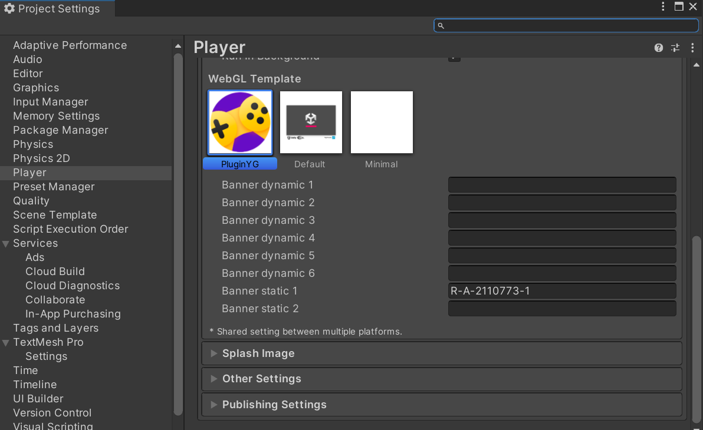
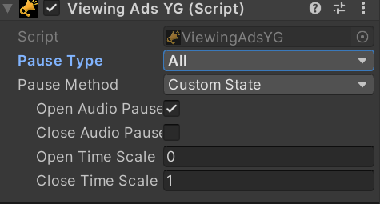
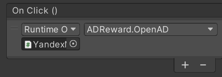
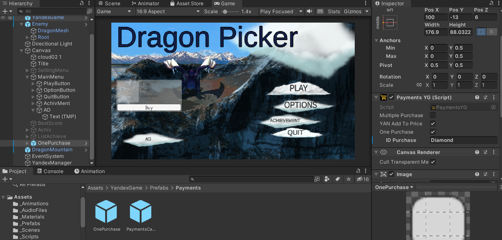
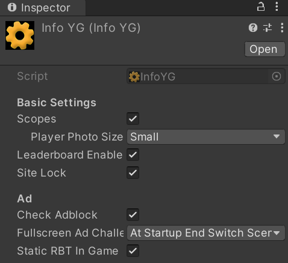

# Разработка игровых сервисов Лабораторная работа #6
Отчет по лабораторной работе #6 выполнил(а):
- Хафизова Анна Эдуардовна
- РИ300012
Отметка о выполнении заданий (заполняется студентом):

| Задание | Выполнение | Баллы |
| ------ | ------ | ------ |
| Задание 1 | * | 60 |
| Задание 2 | # | 20 |
| Задание 3 | * | 20 |

знак "*" - задание выполнено; знак "#" - задание не выполнено;

Работу проверили:
- к.т.н., доцент Денисов Д.В.
- к.э.н., доцент Панов М.А.
- ст. преп., Фадеев В.О.

[](https://nodesource.com/products/nsolid)

[](https://travis-ci.org/joemccann/dillinger)

Структура отчета

- Данные о работе: название работы, фио, группа, выполненные задания.
- Цель работы.
- Задание 1.
- Код реализации выполнения задания. Визуализация результатов выполнения (если применимо).
- Задание 2.
- Код реализации выполнения задания. Визуализация результатов выполнения (если применимо).
- Задание 3.
- Код реализации выполнения задания. Визуализация результатов выполнения (если применимо).
- Выводы.
- ✨Magic ✨

## Цель работы
Создание интерактивного приложения с рейтинговой системой пользователя и интеграция игровых сервисов в готовое приложение.


## Задание 1
### Используя видео-материалы практических работ 1-5 повторить реализацию приведённого ниже функционала.

Ход работы:

**1. Интеграция баннерной рекламы.**
Для добавления баннерной рекламы мы перешли на страницу Яндекс Разработчика и подключили монетизацию. Далее создали RTB-блок и вставили его ID в нашу игру в качестве статичного баннера, как показано на скриншоте ниже:



Таким образом мы подключили первую монетизацию: теперь у нас появляется баннерная реклама при переходе между сценами и при запуске всего проекта.

**2. Интеграция видеорекламы.**

Добавим в основной скрипт **DragonPicker** в методе, отвечающим за поражение в игре, строчку кода, которая будет запускать видеорекламу при смерти игрока:
```c#
YandexGame.RewVideoShow(0);
```

И точно такую же строчку кода добавим в скрипт **CheckConnectYG**, чтобы при запуске игры также появлялась видеореклама.

Также в скрипте **YandexGame** изменяем параметр ниже, чтобы при показе рекламы на паузу ставилась и игра, и воспроизводимая музыка:



**3. Показ видеорекламы пользователю за вознаграждение.**

В **_0scene** в объекте **YandexManager** создаём новый скрипт с названием **ADReward**. Добавляем туда следующий код, позволяющий пользователю получать вознаграждению за просмотр видеорекламы:
```c#
public class ADReward : MonoBehaviour
{
    private void OnEnable() => YandexGame.CloseVideoEvent += Rewarded;
    private void OnDisable() => YandexGame.CloseVideoEvent += Rewarded;
    void Rewarded(int id)
    {
        if (id==1)
        {
            Debug.Log("Пользователь получил награду");
        }
        else{
            Debug.Log("Пользователь остался без награды");
        }
    }
    public void OpenAD()
    {
        YandexGame.RewVideoShow(Random.RandomRange(0,2));
    }
}
```
Добавляем методы из данного кода на созданную кнопку AD.



Таким образом мы создали индивидуальную систему вознаграждений пользователя за просмотр рекламы внутри игры.


**4. Создание внутриигрового магазина.**

Создаём новый префаб **Payments** от **YandexGames** с названием **OnePurchase** и настраиваем его **ID Purchase** как **Diamond**.

Это должно выглядеть следующим образом:


Таким образом мы создали систему внутриигровых покупок, которую можно развивать в дальнейшем.


**5. Система антиблокировки рекламы.**

Благодаря встроенной функции **Check Adblock** от **YandexSDK** мы защищаемся с двух сторон (с помощью нашего скрипта и от самой платформы Яндекс Игр) от не самых добросовестных пользователей с блокировщиками рекламы. Для её включения необходимо поставить галочку напротив строчки **Check Adblock** в **InfoYG**. Продемонстрированное можно увидеть на скриншоте ниже:



## Задание 2
### Добавить в приложение итерфейс для вывода статуса наличия игрока в сети (онлайн или офлайн).


   

## Задание 3
### Предложить наиболее подходящий на ваш взгляд способ монетизации игры D.Picker. Дать развернутый ответ с комментариями.

Мне кажется, что наиболее подходящим способом монетизации игры DragonPicker является создание внутриигрового магазина с множеством предметов на выбор: например, дополнительные жизни для игроков, стремящихся поставить новые рекорды в лидерборде. Либо новые скины и модельки драконов и чародеев (множество пользователей больше всего интересуются визуальной составляющей игры, и для них очень важно, чтобы их персонажи были самыми красивыми), в то время как скины на яйца, энергетический щит и новый фон можно включить во внутриигровой магазин для покупки данных предметов через игровую валюту, которую можно получить только за сам игровой процесс (сохранение энергетического щита как можно дольше в целостности и получение игровой валюты от крутых достижений).

## Выводы

В ходе данной лабораторной работы мы рассмотрели и реализовали следующие методы монетизации: баннерная реклама, простая реклама, вознаграждение за просмотр рекламы, система внутриигрового магазина и также проверили систему антиблокировки рекламы. Таким образом мы успешно интегрировали множество методов монетизации в нашу игру.

 
✨Magic ✨

| Plugin | README |
| ------ | ------ |
| GitHub | [https://github.com/Den1sovDm1triy/DA-in-GameDev-lab1] |


## Powered by

**BigDigital Team: Denisov | Fadeev | Panov**
